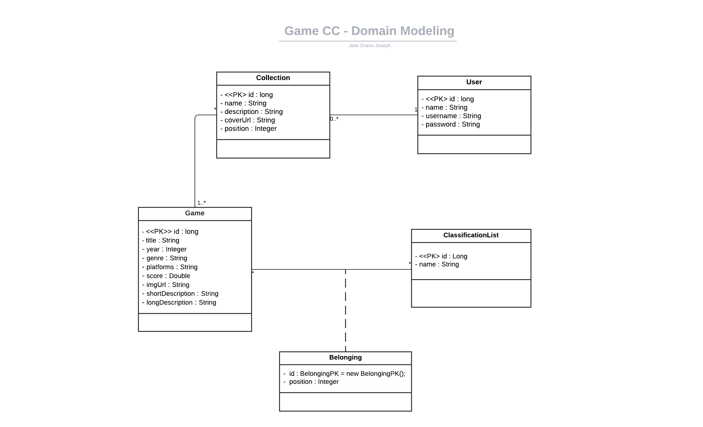
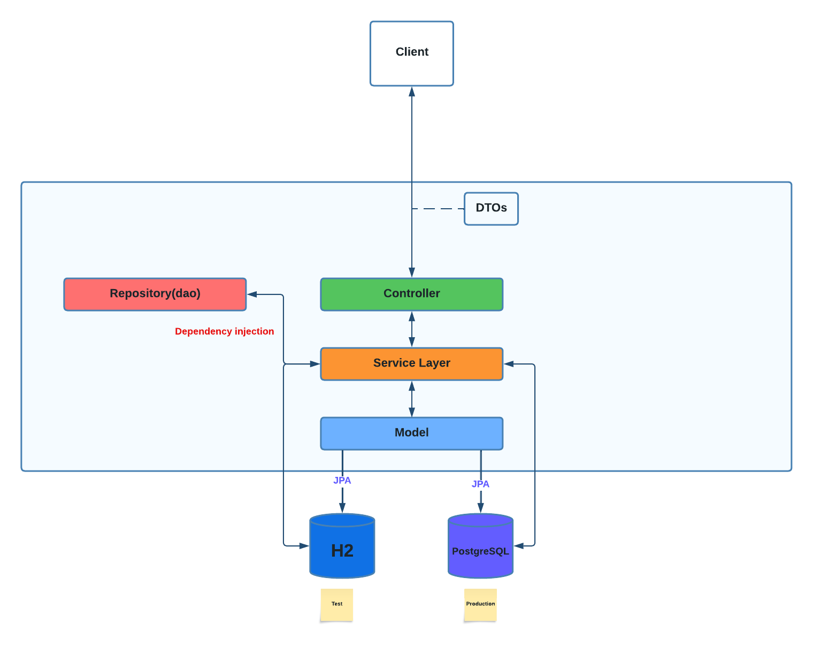

<h1 align="center">Game CC - Collections of Games API 🎮</h1>

### Welcome to Game CC - the Collections of Games API!

## About:
The Game cc API is a powerful tool designed to help users organize and manage their game collections effortlessly. 
Whether you are an avid gamer, a game collector, or simply someone who enjoys exploring different gaming genres, this API has got you covered!

[**| Architecture |**](#architecture-layer-pattern)
[**Domain Model |**](#domain-model)[ **Documentation |**](#domain-model)

## Purpose:
The primary purpose of the Game cc API is to provide users with a seamless experience to create and maintain their game collections. 
It offers an extensive catalog of games, sorted by various categories, making it easy for users to discover new titles and add them to their personal collections.

## Features:
* **Game Catalog:** The API offers an extensive catalog of games, neatly categorized to help users find their favorite games quickly.
* **Collection Creation:** Users can easily create and customize their own collections by selecting games from the catalog.
* **Category Filter:** The API allows users to filter games based on their preferred gaming categories.
* ~~**Personalization:** Users can add personal notes, ratings, and comments to their game entries within the collection.~~
* **Easy Integration:** The Game cc API is built with Java and Spring, making it highly accessible and easy to integrate into any application.
* **Additional features:** The API also enables users to change the position of games within the catalog and the collection. 
This provides flexibility and ease in organizing the list of games according to individual user preferences.

## How to Get Started
**Notices**

I'm excited to announce that I am actively implementing the Game cc API! 
As I work diligently to bring this project to fruition, I want to keep you in the loop about its progress.

To get started with the Game cc API as soon as possible, I'll be providing detailed installation instructions and usage guidelines shortly. 
You'll be able to explore the API's endpoints and routes, allowing you to interact with the game catalog, create collections, and effortlessly manage your gaming world.

Stay tuned for updates, and I can't wait to share more about how to use the Game cc API with you!  

**Happy gaming!!!** 🎮🚀
### Domain Model:

### Architecture: Layer pattern

Happy gaming! 🎉🎲